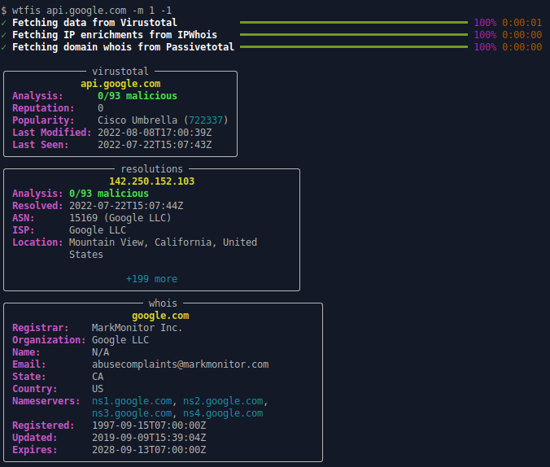
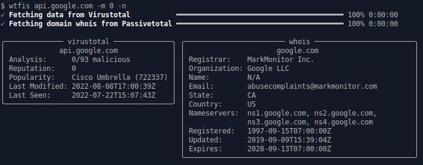

# wtfis

Passive host and domain name lookup tool for human eyes


## WTF is it?

**wtfis** is a commandline tool that gathers information about a domain or FQDN using various OSINT services. Unlike other tools of its kind, it's built specifically for human consumption, providing results that are pretty (YMMV) and easy to read and understand.

This tool assumes that you are using free tier / community level accounts, and so makes as few API calls as possible to minimize hitting quotas and rate limits.


## Data Sources

### Virustotal

The primary source of information. Retrieves:

* [Hostname (FQDN) or domain](https://developers.virustotal.com/reference/domains-1))
    * Latest analysis stats with vendor detail
    * Reputation score (based on VT community votes)
    * Popularity ranks (Alexa, Cisco Umbrella, etc.)
    * Last DNS record update date
    * Date DNS record was last retrieved by VT
* [Resolutions](https://developers.virustotal.com/reference/domain-resolutions)
    * Last n IP addresses (default: 3, max: 10)
    * Latest analysis stats of each IP above
* [Whois](https://developers.virustotal.com/reference/whois)
    * Fallback only: if Passivetotal creds are not available
    * Various whois data about the domain itself

### Passivetotal (RiskIQ)

Optionally used if creds are provided. Retrieves:

* [Whois](https://api.riskiq.net/api/whois_pt/)
    * Various whois data about the domain itself

### IPWhois ([ipwhois.io](https://ipwhois.io/documentation))

IP address enrichments for VT resolutions. For each IP, retrieves the ASN, Org, ISP and Geolcoation.


## Install

```
pip install .
```

## Setup

wtfis uses these environment variables:

* `VT_API_KEY` (required) - Virustotal API key
* `PT_API_KEY` (optional) - Passivetotal API key
* `PT_API_USER` (optional) - Passivetotal API user

Set these using your own method.

Alternatively, create a file in your home directory `~/.env.wtfis` with the above declarations. See [.env.wtfis.example](./.env.wtfis.example) for a template. **NOTE: Don't forget to `chmod 400` the file!**


## Usage

Basically:

```
$ wtfis FQDN_OR_DOMAIN
```

and you will get results organized by panel, similar to the image above.

You can increase or decrease the maximum number of displayed IP resolutions with `-m NUMBER` or `--max-resolutions=NUMBER`. The upper limit is 10. If you don't need resolutions at all, set the number to `0`.

To show all panels in one column, use the `-1` or `--one-column` flag.



Panels can be displayed with no color with `-n` or `--no-color`. 



Finally, there's a help flag (`-h` or `--help`) if you need it.


## TODOs

* JSON output
* Shodan integration
* IP address lookup
* Keyring support
